# Experiment 025 — End-to-End Two-Stage Comparative Benchmark & Latency Profiling

**Date:** 2026-09-17  
**Status:** ✅ Completed  
**Sprint:** Sprint 3 — Two-Stage Retrieval & Learning-to-Rank  
**Ticket:** RLB-332  

---

## 1. Abstract & Executive Summary

Experiment 025 delivers the concluding comparative benchmark of **Sprint 3**, evaluating three fundamentally different retrieval and ranking paradigms on the standardized BEIR SciFact benchmark ($N=300$ test queries, 5,183 corpus abstracts):
1. **Single-Stage Baselines**: Lexical (BM25), Dense (FAISS FlatIP with FastEmbed `bge-small-en-v1.5`), and Hybrid (Reciprocal Rank Fusion 1:2).
2. **Neural Two-Stage**: Union Candidate Pool ($K_{\text{cand}}=50$) re-ranked via full-attention neural cross-encoder (`ms-marco-MiniLM-L-6-v2`) on dedicated GPU.
3. **Tabular GBDT Two-Stage**: Union Candidate Pool ($K_{\text{cand}}=50$) re-ranked via gradient-boosted decision trees ([LightGBMRanker](file:///e:/Downloads/RetrievLab/src/retrievlab/ranking/lightgbm.py)) trained with pairwise **LambdaMART** over 16 deterministic features.

### Primary Measured Findings
- **Quality Dominance**: Tabular GBDT re-ranking with LightGBM achieved the highest retrieval and ranking accuracy across every metric, reaching **`nDCG@5 = 0.7388`** and **`Recall@5 = 0.8168`**. This represents a **+0.0461 nDCG@5 gain** (+4.6% absolute) over the best single-stage baseline (Hybrid RRF `0.6927`), and a **+0.0762 nDCG@5 gain** over the neural Cross-Encoder (`0.6626`).
- **Query-Level Distribution**: On pairwise query-by-query nDCG@5 comparisons, LightGBM outperformed Hybrid RRF on 47 queries (15.7%) while underperforming on 20 queries (6.7%), yielding **2.35× more wins than losses**. Against the neural Cross-Encoder, LightGBM won 75 queries (25.0%) vs. 36 losses (12.0%), yielding **2.08× more wins than losses**.
- **Inference Efficiency**: Pure LightGBM re-ranking (feature extraction + tree traversal) executed in **`25.66 ms/query` on CPU**, operating **17.7× faster** than the GPU-accelerated Cross-Encoder (`455.03 ms/query`).
- **Feature Attribution**: Split gain was heavily dominated by Stage-1 rank provenance (`dense_rank` gain: 57,514.25; `rrf_score` gain: 25,187.16), followed by document length and token overlap signals.

---

## 2. Experimental Setup & Hardware Profile

| Property | Configuration |
|---|---|
| **Benchmark** | BEIR SciFact ($N=300$ test queries, $N=809$ train queries) |
| **Corpus** | 5,183 peer-reviewed biomedical abstracts (scientific claim verification) |
| **Stage-1 Retrievers** | BM25 (`b=0.75, k1=1.2`), FAISS FlatIP (FastEmbed `bge-small-en-v1.5`, 384-dim) |
| **Hybrid Baseline** | Reciprocal Rank Fusion (weights: `bm25=1.0, dense=2.0`, smoothing constant $k=60$) |
| **Candidate Generation** | MultiRetriever Union Pool ($K_{\text{cand}}=50$ per retriever, $\approx 85.5$ candidates/query) |
| **Neural Re-Ranker** | `cross-encoder/ms-marco-MiniLM-L-6-v2` (`max_length=256`, batch size 64) |
| **GBDT Ranker** | LightGBM `LGBMRanker` (`objective="lambdarank"`, `eval_metric="ndcg"`, `eval_at=[5, 10]`, 100 trees, `learning_rate=0.05`, `num_leaves=31`, `min_child_samples=10`) |
| **Training Dataset** | 69,079 candidate pairs generated from 809 train queries ($69{,}079 \times 16$ tabular matrix) |
| **Hardware Environment** | Intel Core CPU, 8 GB System RAM, NVIDIA GeForce GTX 1650 (4 GB VRAM, Driver 592.82, CUDA 12.4) |
| **Software Toolchain** | Python 3.12.13, PyTorch 2.6.0+cu124, LightGBM 4.7.0, FAISS-CPU 1.15.0, FastEmbed 0.8.0 |

---

## 3. Comparative Results Matrix

### Cutoff @5 Results

| System | Paradigm | Recall@5 | Precision@5 | MRR | nDCG@5 | End-to-End Latency | Pure Re-Rank Latency |
|:---|:---|---:|---:|---:|---:|---:|---:|
| **BM25 Single-Stage** | Lexical | 0.7243 | 0.1567 | 0.6339 | 0.6438 | 21.7 ms | — |
| **FAISS Dense Single-Stage** | Dense (Bi-Encoder) | 0.7686 | 0.1707 | 0.6847 | 0.6936 | **12.1 ms** | — |
| **Hybrid RRF (1:2) Single-Stage** | Heuristic Fusion | 0.7777 | 0.1713 | 0.6798 | 0.6927 | 40.8 ms | — |
| **Two-Stage: Union (K=50) + Cross-Encoder** | Neural Cross-Attention | 0.7452 | 0.1653 | 0.6522 | 0.6626 | 494.8 ms | 455.03 ms (GPU) |
| **Two-Stage: Union (K=50) + LightGBM** | Tabular GBDT (LambdaMART) | **0.8168** | **0.1807** | **0.7257** | **0.7388** | 109.6 ms | **25.66 ms (CPU)** |

### Cutoff @10 Results

| System | Paradigm | Recall@10 | Precision@10 | MRR | nDCG@10 | End-to-End Latency |
|:---|:---|---:|---:|---:|---:|---:|
| **BM25 Single-Stage** | Lexical | 0.7816 | 0.0867 | 0.6339 | 0.6646 | 21.7 ms |
| **FAISS Dense Single-Stage** | Dense (Bi-Encoder) | 0.8452 | 0.0953 | 0.6847 | 0.7203 | **12.1 ms** |
| **Hybrid RRF (1:2) Single-Stage** | Heuristic Fusion | 0.8429 | 0.0943 | 0.6798 | 0.7150 | 40.8 ms |
| **Two-Stage: Union (K=50) + Cross-Encoder** | Neural Cross-Attention | 0.8082 | 0.0907 | 0.6522 | 0.6838 | 494.8 ms |
| **Two-Stage: Union (K=50) + LightGBM** | Tabular GBDT (LambdaMART) | **0.8836** | **0.0993** | **0.7257** | **0.7617** | 109.6 ms |

---

## 4. Performance & Ranking Analysis

### 1. Tabular GBDT vs. Single-Stage Baselines
- **Uplift over Hybrid RRF**: LightGBM LambdaMART improved nDCG@5 from `0.6927` to `0.7388` (**+0.0461**, a +6.7% relative improvement) and Recall@5 from `0.7777` to `0.8168` (**+3.9%p**).
- **Uplift over BM25**: Compared to the sparse lexical baseline, LightGBM increased nDCG@5 from `0.6438` to `0.7388` (**+0.0950**, a +14.8% relative improvement) and Recall@5 from `0.7243` to `0.8168` (**+9.3%p**).
- **Reciprocal Rank**: MRR improved from `0.6798` (Hybrid RRF) and `0.6847` (Dense) to **`0.7257`**, indicating that the highest-ranked relevant abstract was consistently promoted into position #1.

### 2. Tabular GBDT vs. Neural Cross-Encoder
- **The Performance Gap**: The LightGBM ranker surpassed the MS MARCO Cross-Encoder by **+0.0762 nDCG@5** (`0.7388` vs. `0.6626`) and **+0.0716 Recall@5** (`0.8168` vs. `0.7452`).
- **Domain Shift vs. In-Domain Training**: While the zero-shot Cross-Encoder was constrained by the vocabulary distribution of MS MARCO web search queries, LightGBM learned to weight biomedical signals directly on SciFact training queries. This enabled LightGBM to prioritize biomedical dense embedding similarities and candidate pool ranks without being misled by colloquial surface-form mismatches.

### 3. Query-Level Win / Loss Distributions

```text
LightGBM vs. Hybrid RRF (1:2):
  ├── LightGBM Wins :  47 queries (15.7%)
  ├── Hybrid RRF Wins:  20 queries ( 6.7%)
  └── Ties          : 233 queries (77.7%)

LightGBM vs. Cross-Encoder (MiniLM):
  ├── LightGBM Wins :  75 queries (25.0%)
  ├── Cross-Encoder :  36 queries (12.0%)
  └── Ties          : 189 queries (63.0%)
```

Across the 300 test queries, LightGBM outperformed Hybrid RRF in more than twice as many queries as it lost (47 vs. 20), demonstrating robust generalization without catastrophic regressions on edge cases.

---

## 5. Latency & Computational Efficiency Profiling

```mermaid
gantt
    title Per-Query Latency Breakdown (ms)
    dateFormat X
    axisFormat %s ms
    section Single-Stage Dense
    Dense FAISS Search : 0, 12.1
    section Single-Stage Hybrid
    BM25 + FAISS + RRF Fusion : 0, 40.8
    section Two-Stage LightGBM
    Stage 1 Candidate Gen (BM25 + FAISS) : 0, 33.8
    16-Feature Extraction + Tree Scoring  : 33.8, 109.6
    section Two-Stage Cross-Encoder
    Stage 1 Candidate Gen (BM25 + FAISS) : 0, 33.8
    GPU Neural Cross-Attention          : 33.8, 494.8
```



| Component | Hardware | Measured Latency | Throughput |
|:---|:---|---:|---:|
| **Stage 1 Candidate Generation ($K=50$)** | CPU Multi-Threaded | 33.8 ms / query | ~30 qps |
| **Pure Cross-Encoder Re-Ranking (85 pairs)** | NVIDIA GTX 1650 (CUDA) | 455.03 ms / query | ~2.2 qps |
| **Pure LightGBM Re-Ranking (85 pairs)** | CPU (OpenMP C++) | **25.66 ms / query** | **~39 qps** |
| **End-to-End LightGBM Serving** | CPU | 109.6 ms / query | ~9.1 qps |
| **End-to-End Cross-Encoder Serving** | CPU + GPU | 494.8 ms / query | ~2.0 qps |

### Efficiency Highlights
1. **17.7× Re-Ranking Speedup**: Scoring candidate pools with LightGBM was 17.7× faster than running batch GPU tensor cross-attention (`25.66 ms` vs. `455.03 ms`).
2. **Offline Training Speed**: Training LightGBM on 69,079 rows across 809 queries took **1.21 seconds** on CPU.
3. **Memory Footprint**: LightGBM training consumed under 50 MB of system RAM and 0 MB of GPU VRAM, ensuring zero risk of memory pressure.

---

## 6. Methodological Deep-Dive & Feature Gain Diagnostics

When optimizing pairwise nDCG via LambdaMART, LightGBM calculates the total split gain contributed by each feature across all 100 trees:

| Feature Name | Category | Gain Importance | Attribution % |
|:---|:---|---:|---:|
| `dense_rank` | Provenance Rank | **57,514.25** | **57.7%** |
| `rrf_score` | Heuristic Fusion | **25,187.16** | **25.3%** |
| `doc_token_count` | Document Length | 4,791.07 | 4.8% |
| `dense_score` | Vector Similarity | 2,023.91 | 2.0% |
| `length_ratio` | Query-Doc Length | 1,831.87 | 1.8% |
| `jaccard_similarity` | Lexical Overlap | 1,644.09 | 1.6% |
| `bm25_rank` | Provenance Rank | 1,521.46 | 1.5% |
| `token_overlap_ratio` | Lexical Overlap | 1,515.96 | 1.5% |
| `bm25_score` | Lexical Score | 1,260.75 | 1.3% |
| `rank_discrepancy` | Modality Divergence | 1,193.46 | 1.2% |
| `modality_preference` | Modality Divergence | 553.12 | 0.6% |
| `query_token_count` | Query Metadata | 534.99 | 0.5% |
| `dense_reciprocal_rank` | Reciprocal Rank | 150.25 | 0.2% |
| `bm25_reciprocal_rank` | Reciprocal Rank | 70.52 | 0.1% |
| `retrieved_by_both` | Binary Agreement | 0.00 | 0.0% |
| `exact_query_match` | Exact Lexical | 0.00 | 0.0% |

### Key Diagnostic Observations
1. **The Rank Dominance Effect**: `dense_rank` (57.7%) and `rrf_score` (25.3%) accounted for over **83% of total model gain**. Rather than relying on raw uncalibrated float scores (which vary widely in scale across queries), tree splits preferentially utilized ordinal rank positions within each query group.
2. **Length Regularization**: `doc_token_count` (4,791.07 gain) and `length_ratio` (1,831.87 gain) provided significant split value, enabling the trees to penalize excessively verbose abstracts that accumulated accidental keyword matches.
3. **Lexical Feature Contribution**: Lexical features (`bm25_rank`, `bm25_score`, `jaccard_similarity`, `token_overlap_ratio`) individually provided 1.3% to 1.6% gain, functioning as secondary filters when dense ranks were close or tied.
4. **Zero-Gain Features**: `exact_query_match` and `retrieved_by_both` contributed 0.00 gain. In SciFact, exact verbatim multi-word query string matches in abstract text are virtually non-existent, rendering the binary match indicator inert.

---

## 7. Key Empirical Findings

### Finding 1 — Tabular LambdaMART Outperforms Neural Cross-Encoders in Cross-Domain Retrieval
On specialized biomedical literature where pre-trained web cross-encoders suffer from domain shift, training a tabular LambdaMART ranker directly on domain-specific candidate pools produced a **+0.0762 nDCG@5 improvement** over zero-shot cross-attention (`0.7388` vs. `0.6626`).

### Finding 2 — Non-Linear GBDT Fusion Surpasses Heuristic RRF
While Reciprocal Rank Fusion linearly combines inverse ranks ($1 / (k + r)$), LightGBM decision trees learn query-dependent non-linear decision boundaries between lexical and dense ranks, improving nDCG@5 from `0.6927` to `0.7388` (+0.0461 uplift) and Recall@5 from `0.7777` to `0.8168`.

### Finding 3 — 17.7× Latency Advantage for Tabular Serving
Evaluating tree ensembles over pre-extracted feature vectors executed in **`25.66 ms/query`**, compared to **`455.03 ms/query`** for GPU batch neural cross-attention, demonstrating that tabular re-ranking provides an exceptional accuracy-to-latency trade-off for production search pipelines.

### Finding 4 — Ordinal Ranks Outperform Raw Scores in GBDT Training
Over 83% of tree split gain was derived from rank-based features (`dense_rank`, `rrf_score`, `bm25_rank`) rather than raw scores (`dense_score`, `bm25_score`), confirming that rank normalization effectively eliminates cross-query score calibration discrepancies.

---

## 8. Sprint 3 Synthesis & Next Research Directions

### Sprint 3 Milestone Summary
With Experiment 025 complete, all goals of **Sprint 3 (Two-Stage Retrieval & Learning-to-Rank)** have been achieved:
- **RLB-300 / 301 / 340**: Established standardized BEIR benchmarks (SciFact) and graded evaluation metrics.
- **RLB-310 / 311 (Exp 022)**: Built candidate pool architecture, identifying $K_{\text{cand}}=50$ as the optimal 96.2% Recall operating point.
- **RLB-320 / 321 (Exp 023)**: Engineered 16 deterministic features and mapped collinearity clusters across 25,663 pairs.
- **RLB-330 (Exp 024)**: Profiled heavy neural Cross-Encoder re-ranking with GPU acceleration.
- **RLB-331 / 332 (Exp 025)**: Implemented `LightGBMRanker` and proved that tabular LambdaMART delivers the highest accuracy (`nDCG@5 = 0.7388`) at 17.7× lower re-ranking latency.

### Recommended Next Research Directions (Sprint 4)
1. **Feature Pruning & Acceleration**: Evaluate whether removing zero-gain features (`exact_query_match`, `retrieved_by_both`) and pruning collinear features reduces feature extraction latency below 10 ms without hurting nDCG.
2. **Cross-Encoder Distillation**: Explore distilling the Cross-Encoder score into a single tabular feature for LightGBM, combining deep cross-attention with fast tree inference.
3. **Cross-Domain Generalization**: Evaluate the trained SciFact LightGBMRanker zero-shot on other BEIR datasets (e.g. NFCorpus, FiQA) to measure tabular out-of-domain transferability.
