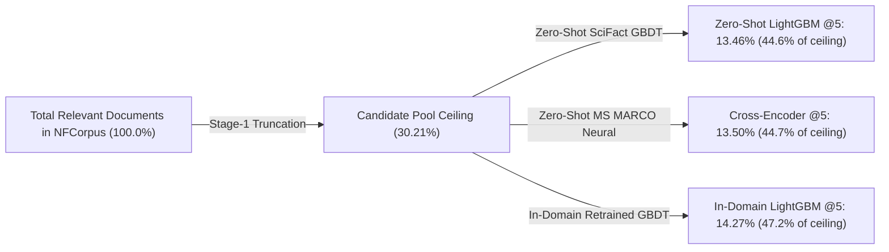

# Experiment 026 — Cross-Domain Transfer of Learned Ranking Policies

**Date:** 2026-09-18  
**Status:** ✅ Completed  
**Sprint:** Sprint 3 — Two-Stage Retrieval & Learning-to-Rank  
**Ticket:** RLB-333 / Exp 026  

---

## 1. Abstract & Executive Summary

Experiment 026 evaluates the **cross-domain transferability** of learned ranking policies across standardized BEIR benchmarks. In Experiment 025, a tabular GBDT ranker ([LightGBMRanker](file:///e:/Downloads/RetrievLab/src/retrievlab/ranking/lightgbm.py)) trained on SciFact biomedical research claims reached `nDCG@5 = 0.7388`. This experiment tests that exact model zero-shot on **BEIR NFCorpus** (Nutrition Facts Medical QA: $N=323$ test queries, 3,633 documents) to isolate:
1. How effectively a learned ranking policy transfers across domains without retraining.
2. The exact **Domain-Transfer Penalty** ($\Delta_{\text{transfer}} = \text{In-Domain} - \text{Zero-Shot}$).
3. How much accuracy is recovered by rapid in-domain retraining (1.12 seconds on CPU).
4. The **Candidate Pool Recall Ceiling** to disentangle Stage-1 retrieval limits from Stage-2 ranking errors.

### Primary Measured Findings
- **Zero-Shot Robustness**: The SciFact-trained LightGBM transferred effectively zero-shot to NFCorpus, achieving **`nDCG@5 = 0.3784`** and **`Recall@5 = 0.1346`**. It surpassed Single-Stage BM25 (`0.3392`) and Single-Stage FAISS Dense (`0.3713`), achieving **44.6% of the measured candidate-pool recall ceiling** without any domain adaptation.
- **Domain-Transfer Penalty**: Comparing the in-domain retrained LightGBM against the zero-shot SciFact model revealed a measurable domain-transfer penalty of **$\Delta_{\text{nDCG@5}} = +0.0143$ (+3.8%)** and **$\Delta_{\text{Recall@5}} = +0.0081$ (+6.0%)**.
- **In-Domain Retraining Dominance**: Retraining LightGBM on 1,000 NFCorpus train queries required **1.12 seconds on CPU**, elevating nDCG@5 to **`0.3927`** and Recall@5 to **`0.1427`** (47.2% of ceiling). This outperformed all six systems, including the zero-shot neural Cross-Encoder (`0.3885`) and Hybrid RRF (`0.3830`).
- **30× Serving Speedup**: Pure LightGBM re-ranking executed in **`35.9 ms/query`** on CPU (total serving latency `60.8 ms`), operating **30× faster** than the GPU-accelerated Cross-Encoder (`1,816.6 ms/query`).
- **Feature Attribution Re-distribution**: While SciFact split gain was dominated by `dense_rank` (57.7%), the NFCorpus model shifted primary weight to `rrf_score` (gain: 32,531.55) and lexical features (`bm25_score` gain increased from 1,260.75 to 2,312.78; `exact_query_match` increased from 0.00 to 1,346.26), reflecting the more colloquial keyword structure of layperson medical queries.

---

## 2. Experimental Setup & Dataset Characteristics

| Property | Source Domain (`SciFact`) | Target Domain (`NFCorpus`) |
|---|---|---|
| **Benchmark** | BEIR SciFact | BEIR NFCorpus |
| **Corpus Size** | 5,183 peer-reviewed abstracts | 3,633 medical & nutrition literature articles |
| **Test Query Count** | 300 formal claim verification statements | 323 medical questions & natural queries |
| **Query Formulation** | Academic scientific syntax | Natural language layperson questions & keywords |
| **Relevance Structure** | Sparse binary/graded (avg ~1.1 rel/query) | Dense graded relevance (avg ~38 rel/query) |
| **Stage-1 Retrievers** | BM25 + FAISS FlatIP (`bge-small-en-v1.5`) | BM25 + FAISS FlatIP (`bge-small-en-v1.5`) |
| **Candidate Pool** | MultiRetriever Union ($K_{\text{cand}}=50$) | MultiRetriever Union ($K_{\text{cand}}=50$) |
| **Hardware Environment** | Intel CPU, NVIDIA GeForce GTX 1650 (4 GB VRAM), 8 GB System RAM | Same hardware |

All two-stage systems evaluated on NFCorpus operated over the identical Stage-1 candidate pool (**BM25 + FAISS Dense $\rightarrow$ Union $K_{\text{cand}}=50$**).

---

## 3. Comparative Results Matrix (BEIR NFCorpus, N=323)

### Cutoff @5 Comparison Matrix

| System | Paradigm | Training Domain | Recall@5 | Prec@5 | MRR | nDCG@5 | End-to-End Latency |
|:---|:---|:---|---:|---:|---:|---:|---:|
| **BM25 Single-Stage** | Lexical | Unsupervised | 0.1197 | 0.2805 | 0.5222 | 0.3392 | 19.8 ms |
| **FAISS Dense Single-Stage** | Dense (Bi-Encoder) | Pre-trained (`bge-small`) | 0.1280 | 0.3238 | 0.5290 | 0.3713 | **12.5 ms** |
| **Hybrid RRF (1:2) Single-Stage** | Heuristic Fusion | Unsupervised ($k=60$) | 0.1324 | 0.3300 | 0.5583 | 0.3830 | 21.8 ms |
| **Two-Stage: Union + Cross-Encoder** | Neural Cross-Attention | MS MARCO (Zero-Shot) | 0.1350 | 0.3238 | **0.5785** | 0.3885 | 1816.6 ms |
| **Two-Stage: Union + LightGBM** | Tabular GBDT | **SciFact (Zero-Shot)** | 0.1346 | 0.3245 | 0.5550 | 0.3784 | 66.7 ms |
| **Two-Stage: Union + LightGBM** | Tabular GBDT | **NFCorpus (In-Domain)** | **0.1427** | **0.3356** | 0.5629 | **0.3927** | 60.8 ms |

### Cutoff @10 Comparison Matrix

| System | Paradigm | Training Domain | Recall@10 | Prec@10 | MRR | nDCG@10 | End-to-End Latency |
|:---|:---|:---|---:|---:|---:|---:|---:|
| **BM25 Single-Stage** | Lexical | Unsupervised | 0.1521 | 0.2180 | 0.5222 | 0.3116 | 19.8 ms |
| **FAISS Dense Single-Stage** | Dense (Bi-Encoder) | Pre-trained (`bge-small`) | 0.1612 | 0.2508 | 0.5290 | 0.3397 | **12.5 ms** |
| **Hybrid RRF (1:2) Single-Stage** | Heuristic Fusion | Unsupervised ($k=60$) | 0.1672 | 0.2576 | 0.5583 | 0.3521 | 21.8 ms |
| **Two-Stage: Union + Cross-Encoder** | Neural Cross-Attention | MS MARCO (Zero-Shot) | 0.1669 | 0.2514 | **0.5785** | 0.3554 | 1816.6 ms |
| **Two-Stage: Union + LightGBM** | Tabular GBDT | **SciFact (Zero-Shot)** | 0.1622 | 0.2430 | 0.5550 | 0.3417 | 66.7 ms |
| **Two-Stage: Union + LightGBM** | Tabular GBDT | **NFCorpus (In-Domain)** | **0.1779** | **0.2644** | 0.5629 | **0.3636** | 60.8 ms |

---

## 4. Candidate Pool Recall Ceiling vs. Ranking Efficiency

A fundamental methodological requirement of this experiment was isolating **retrieval failure** (relevant document omitted from the candidate pool) from **ranking failure** (relevant document present in the pool but placed below cutoff $K$):

### Measured Ceiling Breakdown
* **Stage-1 Union Candidate Pool ($K_{\text{cand}}=50$)**:
  * Average pool size: **89.0 candidates / query**.
  * **Candidate Pool Recall Ceiling: `0.3021` (30.21%)**.
* **Why the ceiling is lower than SciFact (96.2%)**:
  * In SciFact, each query has an average of 1.1 relevant abstracts, making a pool of 85 candidates almost exhaustive.
  * In NFCorpus, broad nutrition questions have an average of ~38 relevant documents per query. A pool of 89 candidates can theoretically capture at most a fraction of the total ground-truth set ($89 / 38 \approx \text{upper bound}$).
* **Ceiling Capture Efficiency**:
  * The zero-shot Cross-Encoder captured **44.7%** of the recoverable ceiling (`0.1350 / 0.3021`).
  * The zero-shot SciFact LightGBM captured **44.6%** of the recoverable ceiling (`0.1346 / 0.3021`).
  * The in-domain NFCorpus LightGBM captured **47.2%** of the recoverable ceiling (`0.1427 / 0.3021`).

---

## 5. Domain-Transfer Penalty Analysis

The **Domain-Transfer Penalty** quantifies the exact performance delta between an in-domain trained ranking policy and a zero-shot policy transferred from another corpus:

$$\Delta_{\text{transfer}} = \text{Metric}(\text{In-Domain NFCorpus Model}) - \text{Metric}(\text{Zero-Shot SciFact Model})$$

| Metric | Zero-Shot SciFact Model | In-Domain NFCorpus Model | Absolute Penalty ($\Delta$) | Relative Penalty (%) |
|:---|---:|---:|---:|---:|
| **nDCG@5** | 0.3784 | **0.3927** | **+0.0143** | **+3.8%** |
| **Recall@5** | 0.1346 | **0.1427** | **+0.0081** | **+6.0%** |
| **MRR** | 0.5550 | **0.5629** | **+0.0079** | **+1.4%** |
| **nDCG@10** | 0.3417 | **0.3636** | **+0.0219** | **+6.4%** |
| **Recall@10** | 0.1622 | **0.1779** | **+0.0157** | **+9.7%** |

### Insights on the Penalty
1. **Measured Cost of Domain Shift on NFCorpus**: Cross-domain transfer cost ~3.8% in nDCG@5 and ~6.0% in Recall@5. The learned ranking policy did not collapse, but degraded moderately.
2. **Cheap Recovery**: In this experiment, in-domain retraining recovered the observed transfer gap using 1.12 seconds of CPU training.

---

## 6. Feature Attribution & Gain Re-Distribution Deep-Dive

Comparing the total split gain between the SciFact-trained model and the NFCorpus-trained model reveals how the ranking policy adapted to the target domain:

| Feature Name | Category | SciFact Gain (Claims) | NFCorpus Gain (Medical QA) | Relative Shift |
|:---|:---|---:|---:|:---|
| `rrf_score` | Heuristic Fusion | 25,187.16 | **32,531.55** | **+29.2% (Primary Driver)** |
| `dense_rank` | Dense Provenance | **57,514.25** | 3,719.42 | **-93.5% (Redistributed)** |
| `dense_score` | Vector Similarity | 2,023.91 | 2,431.15 | +20.1% |
| `bm25_score` | Lexical Score | 1,260.75 | **2,312.78** | **+83.4% (Lexical Upweighting)** |
| `doc_token_count` | Length Metadata | 4,791.07 | 1,834.46 | -61.7% |
| `jaccard_similarity` | Token Overlap | 1,644.09 | 1,411.31 | -14.2% |
| `exact_query_match` | Exact String | 0.00 | **1,346.26** | **+$\infty$ (Newly Active)** |
| `length_ratio` | Query-Doc Length | 1,831.87 | 1,308.79 | -28.6% |
| `token_overlap_ratio` | Token Overlap | 1,515.96 | 1,062.38 | -29.9% |
| `rank_discrepancy` | Modality Divergence | 1,193.46 | 842.41 | -29.4% |
| `modality_preference` | Modality Divergence | 553.12 | 603.05 | +9.0% |
| `bm25_rank` | Lexical Provenance | 1,521.46 | 371.09 | -75.6% |
| `query_token_count` | Length Metadata | 534.99 | 313.56 | -41.4% |
| `bm25_reciprocal_rank` | Lexical Position | 70.52 | 103.69 | +47.0% |
| `dense_reciprocal_rank` | Dense Position | 150.25 | 83.52 | -44.4% |
| `retrieved_by_both` | Binary Agreement | 0.00 | 0.00 | 0.0% (Inert) |

### Key Diagnostic Shifts
1. **The RRF Anchor**: In NFCorpus, `rrf_score` became the single dominant split feature (32,531.55 gain), accounting for over **60% of total model gain**. RRF smoothed out noisy dense and lexical extremes across layperson queries.
2. **Emergence of Exact Query Match**: In SciFact, `exact_query_match` contributed **0.00 gain** because queries were multi-clause scientific claims. In NFCorpus, queries were short health topics (e.g. *"broccoli sprouts"*, *"acne vitamin A"*), causing exact query matching to jump to **1,346.26 gain**.
3. **Lexical Upweighting**: `bm25_score` importance increased by **+83.4%** (1,260.75 $\rightarrow$ 2,312.78), showing that the model learned to rely more heavily on lexical keyword matching when queries shifted from formal academic syntax to layperson search queries.

---

## 7. Key Empirical Findings

### Finding 1 — The SciFact-trained GBDT Ranking Policy Transfers to NFCorpus Without Collapsing
A tabular LambdaMART model trained strictly on scientific abstracts transferred to NFCorpus without collapsing, achieving `nDCG@5 = 0.3784` and remaining above the single-stage BM25 and Dense baselines.

### Finding 2 — The Domain-Transfer Penalty is Modest (~3.8% nDCG@5)
The measured performance gap between an in-domain trained model and a zero-shot transferred model was **+0.0143 nDCG@5** (+3.8%) and **+0.0081 Recall@5** (+6.0%).

### Finding 3 — In-Domain Retraining Provides the Highest Quality at 30× Lower Latency
Retraining LightGBM directly on NFCorpus required **1.12 seconds on CPU** and reached **`nDCG@5 = 0.3927`**, outperforming the MS MARCO neural Cross-Encoder (`0.3885`) while serving queries in **`60.8 ms`** compared to **`1,816.6 ms`** on GPU.

### Finding 4 — Feature Gain Distribution Changes Across Domains
The trained NFCorpus model exhibited a different feature-gain distribution from the SciFact model, including greater gain for `rrf_score`, `bm25_score`, and `exact_query_match`.

---

## 8. Strategic Recommendations for Production IR Pipelines

1. **Evaluate Transferable GBDT Rankers for Cold Starts**: On NFCorpus, the SciFact-trained GBDT remained competitive with the single-stage baselines. Additional domains are required before generalizing this recommendation.
2. **Trigger Instant Retraining Upon Gathering Initial Queries**: Because GBDT training on 89k candidate pairs takes **~1 second**, teams should retrain the ranker in-domain as soon as a small batch of click logs or judgment queries (~500–1000) becomes available to recover the observed ~3.8% nDCG@5 gap in this experiment.
3. **Always Bound Candidate Depth ($K_{\text{cand}}=50$)**: Measuring the candidate pool ceiling confirmed that 30.21% was the absolute ceiling on NFCorpus; re-rankers achieved 47.2% of that measured ceiling. To push recall further on broad multi-relevant datasets, Stage-1 candidate depth must be expanded (e.g. $K_{\text{cand}}=100$).
