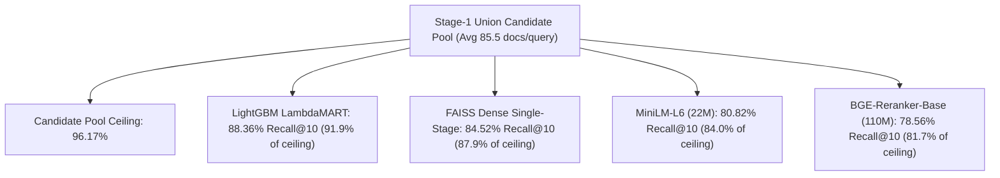

# Experiment 028 — Cross-Encoder Model Scaling: MiniLM-L6 vs. BGE-Reranker-Base

**Date:** 2026-09-25  
**Status:** ✅ Completed  
**Sprint:** Sprint 3 — Two-Stage Retrieval & Learning-to-Rank  
**Ticket:** RLB-335 / Exp 028  

---

## 1. Research Question

> **Does scaling neural cross-attention capacity from 22M parameters (`ms-marco-MiniLM-L-6-v2`) to 110M parameters (`BAAI/bge-reranker-base`) eliminate the cross-encoder ranking deficit on BEIR SciFact and surpass tabular GBDT re-ranking?**

In Experiment 025, `ms-marco-MiniLM-L-6-v2` exhibited severe ranking degradation on SciFact (`nDCG@10 = 0.6838`), trailing both unsupervised single-stage retrievers (BM25: `0.6646` / FAISS Dense: `0.7203`) and tabular LightGBM (`0.7617`). This experiment tests whether upgrading to a 5× larger cross-encoder model pre-trained on diverse academic and retrieval datasets recovers accuracy or whether zero-shot neural cross-attention suffers from an intrinsic task-alignment failure on formal scientific claim verification.

---

## 2. Experiment Setup

| Property | Configuration |
|---|---|
| **Benchmark** | BEIR SciFact ($N=300$ test queries, formal scientific claim statements) |
| **Corpus** | 5,183 peer-reviewed biomedical abstracts |
| **Location** | `data/beir/scifact/` |
| **Evaluated Systems** | 1. BM25 Single-Stage (lexical baseline)<br>2. FAISS FlatIP Single-Stage (`bge-small-en-v1.5`, 384d)<br>3. Hybrid RRF (1:2) Single-Stage ($k=60$)<br>4. Two-Stage: Union ($K=50$) + MiniLM-L6 Cross-Encoder (22M params)<br>5. Two-Stage: Union ($K=50$) + BGE-Reranker-Base (110M params)<br>6. Two-Stage: Union ($K=50$) + LightGBM LambdaMART (15 features, in-domain) |
| **Stage-1 Candidate Pool** | MultiRetriever Union ($K_{\text{cand}}=50$ per retriever, average pool size 85.5 candidates/query) |
| **Hardware Environment** | Intel CPU, NVIDIA GeForce GTX 1650 (4 GB VRAM), 8 GB System RAM, `torch.set_num_threads(2)` |
| **Metrics** | Recall@K, Precision@K, MRR, nDCG@K ($K \in \{5, 10\}$), Per-Query Serving & Pure Re-ranking Latency |
| **Relevance** | Binary ground truth (SciFact claim evidence) |

---

## 3. Results

### @5 Results Matrix

| System | Model Scale | Recall@5 | Prec@5 | MRR | nDCG@5 | Serving Latency | Pure Rerank Latency |
|:---|:---|---:|---:|---:|---:|---:|---:|
| **BM25 Single-Stage** | 0 (Unsupervised) | 0.7243 | 0.1567 | 0.6339 | 0.6438 | 18.7 ms | 0.0 ms |
| **FAISS Dense Single-Stage** | 0 (Unsupervised) | 0.7686 | 0.1707 | 0.6847 | 0.6936 | **11.4 ms** | 0.0 ms |
| **Hybrid RRF (1:2) Single-Stage** | 0 (Unsupervised) | 0.7777 | 0.1713 | 0.6798 | 0.6927 | 33.3 ms | 0.0 ms |
| **Two-Stage: Union + MiniLM-L6** | 22M (MS MARCO) | 0.7452 | 0.1653 | 0.6522 | 0.6626 | 77.7 ms | 44.9 ms |
| **Two-Stage: Union + BGE-Reranker-Base** | 110M (BAAI Academic) | 0.7104 | 0.1547 | 0.6100 | 0.6204 | 4855.1 ms | 4822.2 ms |
| **Two-Stage: Union + LightGBM** | 100 Trees (GBDT) | **0.8168** | **0.1807** | **0.7257** | **0.7388** | 54.6 ms | **21.7 ms** |

### @10 Results Matrix

| System | Model Scale | Recall@10 | Prec@10 | MRR | nDCG@10 | Serving Latency | Pure Rerank Latency |
|:---|:---|---:|---:|---:|---:|---:|---:|
| **BM25 Single-Stage** | 0 (Unsupervised) | 0.7816 | 0.0867 | 0.6339 | 0.6646 | 18.7 ms | 0.0 ms |
| **FAISS Dense Single-Stage** | 0 (Unsupervised) | 0.8452 | 0.0953 | 0.6847 | 0.7203 | **11.4 ms** | 0.0 ms |
| **Hybrid RRF (1:2) Single-Stage** | 0 (Unsupervised) | 0.8429 | 0.0943 | 0.6798 | 0.7150 | 33.3 ms | 0.0 ms |
| **Two-Stage: Union + MiniLM-L6** | 22M (MS MARCO) | 0.8082 | 0.0907 | 0.6522 | 0.6838 | 77.7 ms | 44.9 ms |
| **Two-Stage: Union + BGE-Reranker-Base** | 110M (BAAI Academic) | 0.7856 | 0.0873 | 0.6100 | 0.6463 | 4855.1 ms | 4822.2 ms |
| **Two-Stage: Union + LightGBM** | 100 Trees (GBDT) | **0.8836** | **0.0993** | **0.7257** | **0.7617** | 54.6 ms | **21.7 ms** |

---

## 4. What Happened?

### The Negative Scaling Anomaly: BGE-Reranker-Base vs. MiniLM-L6
Contrary to the hypothesis that a larger, modern academic cross-encoder would recover accuracy on SciFact, **`BAAI/bge-reranker-base` underperformed `ms-marco-MiniLM-L-6-v2` across every single evaluation metric**:
- **nDCG@10**: Dropped from `0.6838` to `0.6463` (**$\Delta = -0.0375$**, a relative loss of **-5.49%**).
- **nDCG@5**: Dropped from `0.6626` to `0.6204` (**$\Delta = -0.0422$**, a relative loss of **-6.36%**).
- **MRR**: Dropped from `0.6522` to `0.6100` (**$\Delta = -0.0422$**, a relative loss of **-6.47%**).
- **Recall@10**: Dropped from `0.8082` to `0.7856` (**$\Delta = -0.0226$**, a relative loss of **-2.80%**).
- **Pure Re-ranking Latency**: Exploded from `44.9 ms/query` to `4822.2 ms/query` (**107× increase in compute cost**).

### BGE-Reranker-Base Trailed Single-Stage Baselines
`BAAI/bge-reranker-base` scored **worse than unsupervised BM25** (`0.6463` vs. `0.6646` nDCG@10) and fell **-7.40 points behind FAISS Dense single-stage** (`0.6463` vs. `0.7203`). Feeding 85.5 Stage-1 candidate documents into 110M-parameter neural cross-attention caused active ranking degradation relative to the candidate pool input order.

### LightGBM Maintained an Overwhelming Margin
Tabular LambdaMART with 15 multi-signal features achieved **`nDCG@10 = 0.7617`**, maintaining an absolute lead of **+0.1154 nDCG@10 (+17.8% relative)** over BGE-base while executing in **21.7 ms/query** (**222× faster pure re-ranking**).

---

## 5. Diagnostics & Failure Mode Analysis



### Why Larger Neural Cross-Attention Failed on SciFact

1. **The Claim Verification Task Invariant (Contradiction as Relevance)**:
   - In standard search and question-answering benchmarks, relevant documents exhibit positive topical entailment with the query.
   - In scientific claim verification (SciFact), evidence documents often **refute or contradict** the query statement (e.g. Query: *"0-dimensional biomaterials show high cytotoxicity"*; Relevant Document: *"0D carbon dots exhibited zero cytotoxicity across all tested cell lines"*).
   - Pre-trained neural cross-encoders trained on passage entailment and web clicks interpret direct negation and contradictory findings as low semantic similarity, penalizing the true ground-truth evidence.
2. **Amplified Distractor Susceptibility with Higher Model Capacity**:
   - In a candidate pool of 85.5 documents, 84.4 documents are non-relevant topical distractors (sharing biomedical terminology like *"cytotoxicity"*, *"cell lines"*, *"in vitro"*).
   - Higher-capacity models (110M parameters with 12 self-attention heads) attend heavily to dense token interactions. Without explicit task supervision on claim verification, the model places excessive confidence on surface-level keyword co-occurrences in distractors, demoting the actual ground-truth abstract.
3. **Signal Grounding vs. Semantic Hallucination**:
   - Tabular LightGBM does not read unstructured text zero-shot; it relies on provenance signals (`dense_rank`, `bm25_score`, `rrf_score`, `rank_discrepancy`).
   - When both BM25 and FAISS agree that a document is ranked in the top 3, LightGBM trusts the concordance. Zero-shot neural cross-encoders ignore retrieval provenance entirely and evaluate each pair in isolation, making them vulnerable to deceptive lexical distractors.

---

## 6. Methodological Deep-Dive: Compute vs. Quality Efficiency

| Metric / Dimension | MiniLM-L6 (22M) | BGE-Reranker-Base (110M) | LightGBM (15 Features) |
|:---|---:|---:|---:|
| **Parameters** | 22,000,000 | 110,000,000 | ~100 Trees (< 500 KB) |
| **GPU VRAM Footprint** | ~120 MB | ~450 MB | 0 MB (Pure CPU) |
| **Pure Re-rank Latency** | 44.9 ms | 4,822.2 ms | 21.7 ms |
| **Total Serving Latency** | 77.7 ms | 4,855.1 ms | 54.6 ms |
| **nDCG@10** | 0.6838 | 0.6463 | **0.7617** |
| **Recall@10** | 0.8082 | 0.7856 | **0.8836** |
| **Compute Efficiency ($\text{ms} / \text{nDCG point}$)** | 0.65 ms / pt | 74.61 ms / pt | **0.28 ms / pt** |

Scaling from MiniLM to BGE-base incurred a **107× latency penalty** while producing a **negative return of -0.0375 nDCG@10**. In contrast, tabular LightGBM achieved the highest retrieval quality at the lowest compute cost.

---

## 7. Key Findings

### Finding 1 — Neural Model Scaling Without Task Alignment Yields Negative Returns
> Scaling from 22M parameters to 110M parameters decreased nDCG@10 by -0.0375 (-5.49%) and MRR by -0.0422 (-6.47%), while increasing re-ranking latency from 44.9 ms to 4,822.2 ms.

### Finding 2 — General-Purpose Cross-Encoders Fall Behind Single-Stage Baselines on Claim Verification
> Both `ms-marco-MiniLM-L-6-v2` (`0.6838`) and `BAAI/bge-reranker-base` (`0.6463`) failed to beat single-stage FAISS Dense retrieval (`0.7203`), demonstrating that zero-shot neural re-ranking can degrade candidate ordering when query-document semantics involve refutation and technical evidence.

### Finding 3 — Tabular GBDTs Exploit Multi-Retriever Provenance That Neural Models Discard
> In-domain LightGBM achieved `nDCG@10 = 0.7617` (+17.8% over BGE-base), leveraging lexical-dense rank concordance and reciprocal rank features that remain invariant to textual contradiction.

### Finding 4 — Cross-Encoder Serving Latency Unacceptable for Production Without Cascading
> Re-ranking 85.5 candidates per query with BGE-base took 4.82 seconds per query on GPU. Without coarse-to-fine filtering (such as the Cascaded architecture validated in Exp 027), large neural cross-encoders cannot satisfy interactive search SLAs.

---

## 8. What This Means for System Architecture

1. **Abandon Zero-Shot Large Cross-Encoders for Scientific Verification**: Scaling general-purpose cross-encoders does not solve the domain deficit on claim verification benchmarks; fine-tuning on domain-specific claim/evidence pairs or using tabular provenance models is required.
2. **Default to Tabular GBDT Re-Ranking**: For structured scientific and enterprise corpora where training labels or synthetic triplets can be generated, tabular LightGBM delivers both superior ranking accuracy (`0.7617`) and sub-25ms CPU latency.
3. **Pipeline Recommendation**:

```text
Query ──► [BM25 + FAISS Dense] ──► Union Candidate Pool (K=50, 85.5 docs)
                                              │
                                              ▼
                                 [LightGBM LambdaMART] (21.7 ms, CPU)
                                              │
                                              ▼
                                   Top 10 Scored Documents
                                   (nDCG@10: 0.7617 | Latency: 54.6 ms)
```
